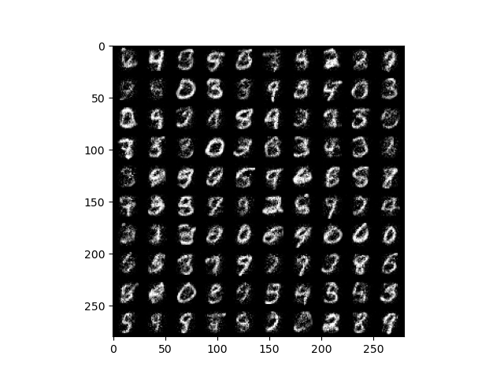

## NICE: Non-linear Independent Components Estimation
Pytorch implemantation of Laurent Dinh's paper [*NICE: Non-linear Independent Components Estimation*](https://arxiv.org/abs/1410.8516)  
Currently available only for MNIST dataset  

### To use  
    train.py [-h] [--dataset DATASET] [--batch_size BATCH_SIZE] [--lr LR] [--b1 B1] [--b2 B2] [--eps EPS]
                [--weight_decay WEIGHT_DECAY] [--epoch EPOCH] [--new_training NEW_TRAINING]
              
    optional arguments:
    -h, --help            show this help message and exit
    --dataset DATASET     Select dataset to train. expected value : [mnist, tfd, svhn, cifar10]
    --batch_size BATCH_SIZE
                            Number of data to learn at a time
    --lr LR               Learning rate for optimization
    --b1 B1               Beta1 for AdaM optimizer
    --b2 B2               Beta2 for AdaM optimizer
    --eps EPS             Epsilon for AdaM optimizer
    --weight_decay WEIGHT_DECAY
                            Weight decay for AdaM optimizer
    --epoch EPOCH         Set training epoch
    --new_training NEW_TRAINING
                            1 to Start new training 0 to continue existing training

### Preprocessing
#### Dequantize
    CIFAR-10: Uniform noise of 1/128 and rescale the data to be in [-1, 1]D for CIFAR-10
    그외: Uniform noise of 1/256 to the data and rescale it to be in [0, 1]D after dequantization
#### Etc
    MNIST: None
    TFD: Approx, whitening
    SVHN: ZCA
    CIFAR-10: ZCA
### Model structure
    MNIST: 1000 units, 5 hidden layers
    TFD: 5000 units, 4 hidden layers
    SVHN: 2000 units, 4 hidden layers
    CIFAR-10: 2000 units, 4 hidden layers
### Optimization
  #### Loss function
    MNIST: logistic
    TFD: gaussian
    SVHN: logistic
    CIFAR-10: logistic
  #### Optimizer
    AdaM
